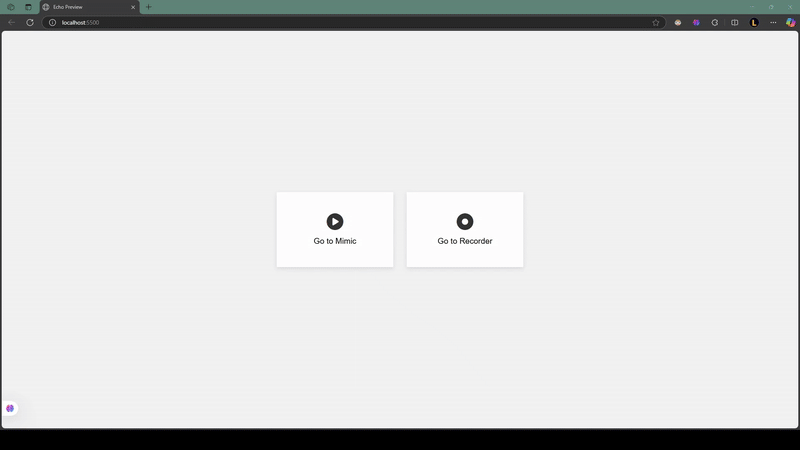

# Echo

**Echo** is a session recording and replay system that enables the capture and visual reproduction of user interactions in websites.
It consists of client-side code to capture user interactions in real-time, and server-side code to save and retrieve user interactions.

```
Echo/
├── Echo.run/           # Runtime configuration files (e.g., launch profiles)
├── Lib/                # Shared client and server libraries
├── Preview/            # Server and client for preview of recording and mimic
├── .gitignore          # Files and folders to ignore in version control
└── echo.sln            # .NET solution file
```

## Features
- Real-Time Recording: Capture user interactions as they occur.
- Accurate Replay: Reproduce user sessions within an iframe for analysis.
- Privacy Controls: Implement data masking to protect sensitive user information during recording and playback.

## Use Cases
- Bug Reproduction: Developers can replay exact user flows that led to errors.
- UX Analysis: Product teams can visualize how users interact with interfaces.
- Compliance: With data masking, user sessions can be analyzed securely.

## Server Components
The server side of Echo consists of the following main components:

- **EchoServer:** A .NET application that hosts the SignalR hub and manages the connection with clients.
- **EchoLib:** A .NET library that provides core functionality used by the server. 
- **SignalR Hub:** Facilitates real-time, bidirectional communication between the server and clients.

## Client Components
The client side includes:

- **EchoMimic:** A component responsible for replaying recorded user interactions within an iframe.
- **EchoRecorder:** Captures user interactions and prepares them for transmission.
- **EchoData:** A data structure representing captured events.
- **Event Handlers:** A collection of specialized handlers for different types of user interactions.

## Data Flow
Echo processes data through two main pipelines:

### Recording Pipeline
- User interactions are captured by specialized event handlers.
- Captured events are converted into standardized EchoData objects.
- EchoData objects are transmitted to the server via SignalR.
- The server, utilizing EchoLib, saves the received events for future replay.

### Replay Pipeline
- The EchoMimic component receives events from the server through a SignalR connection.
- Events are queued and processed sequentially.
- Processed events are visually reproduced within an iframe element.

## Quick Start

```bash
# Clone project
git clone https://github.com/delt4d/Echo.git

# Build and start the client
cd Echo/Lib/Client
npm install
npm run build

# Run the preview server
cd Echo/Preview/Server
dotnet run

# Run the preview client
cd Echo/Preview/Client
npm install
npm run start
```

## Preview
Ensure both the server and client preview applications are running.
Open http://localhost:5500/recorder and perform actions like moving the mouse or typing.
Then navigate to http://localhost:5500/mimic to watch your session replayed inside an iframe.



## Usage
Build the client library, move `dist/` contents to the website folder and reference it in a script tag.
```html
<!-- Make sure this script is loaded before using <echo-mimic> -->
<script src="{directory_location}/echo/index.js"></script>
```

🎥 Start Recording (Client)
To capture and stream user interactions in real-time:

```javascript
const echoRecorder = new EchoRecorder();

for await (const echoData of echoRecorder.getChangesAsync()) {
    const data = echoData.toJson();
    // Send `data` to your server or process it directly
}
```
Each echoData is a structured event representing user activity.

🔁 Replay a Session (Client)
You can replay a recorded session using the `<echo-mimic>` custom element:
```html
<echo-mimic id="player"></echo-mimic>
```

In Javascript:

```javascript
const echoMimic = new EchoMimic(document.getElementById("player"));

// Option 1: Queue events to be executed sequentially
await echoMimic.enqueueAsync(EchoData.fromJson(data));

// Option 2: Execute immediately (useful for testing or manual control)
await echoMimic.executeAsync(EchoData.fromJson(data));
```